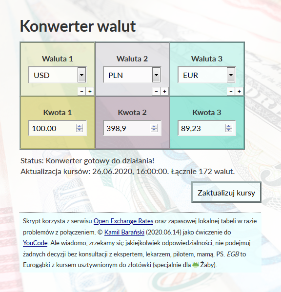

# currencyCalculator
**Currency calculator in JS** (<a href="https://kamilbaranskicom.github.io/currencyCalculator/" target="_BLANK">demo</a>) [PL]

- using [Open Exchange Rates](https://openexchangerates.org/) API to download currency rate (171 currencies at the moment)
- EGB - *Eurogąbki* - Polish joke - virtual currency used in Polish social media network nk.pl (*Eurogąbki* is translated to *Eurosponges*). Flat rate 1 EGB = 0.1 PLN.
- coloring the currencies always the same (so we're converting *USD* to rgb)
- backup rates (if any problem with Open Exchange Rates API)
- priority order when adding the currencies
- Polish interface; international code, written as an exercise in JS/HTML/CSS/BEM.